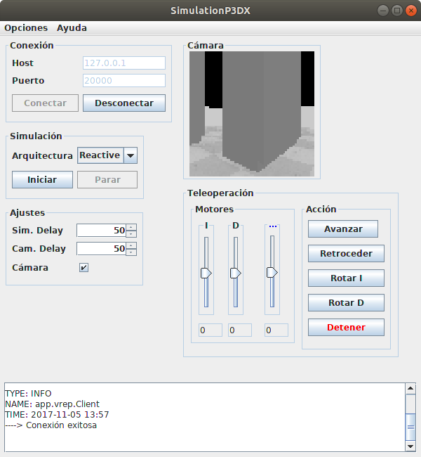
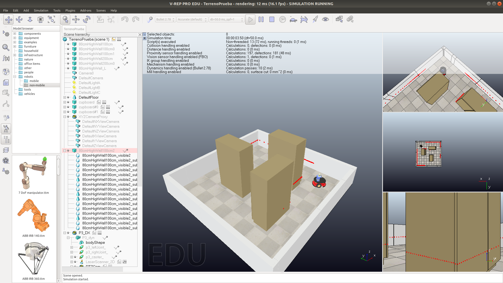

Simulation P3DX
===============

Descripción
-----------
Simulación de robot Pioneer P3-DX a través del simulador VREP http://www.coppeliarobotics.com/.

- Copyright: 2014 Saúl Piña <sauljabin@gmail.com>, Jorge Parra <thejorgemylio@gmail.com>
- Repository: https://github.com/sauljabin/simulation-p3dx
- License: MIT
- Language: Java

V-REP
-----

Versión [3.4.0](http://coppeliarobotics.com/files/V-REP_PRO_EDU_V3_4_0_Linux.tar.gz)

API JAVA para conectarse a v-rep: en la ruta
`VREP_PATH/programming/remoteApiBindings/java/java/coppelia`
se ecuentran las clases JAVA, estas se copiaron dentro del proyecto en el paquete `coppelia`.

Además, se debe instalar el API, para esto crear las siguiente variables de entorno en `bashrc`, ejemplo en linux:

```
export VREP_PATH=/home/saul/Programas/v-rep
export LD_LIBRARY_PATH=/lib:/usr/lib:/usr/local/lib:$VREP_PATH/programming/remoteApiBindings/java/lib/64Bit
```

Documentación
-------------
[Informe](documents/informe)

[Escena](documents/scenes)

Comandos
--------

```
make run

make clean
```

Iniciar Aplicación
------------------

Ejecutar v-rep y abrir la escena `documents/scenes/TerrenoPrueba.ttt` e iniciar simulación.

Correr aplicación con `make run`, conectar la aplicación y luego iniciar la simulación con la arquitectura deseada.

Screenshots
-----------



